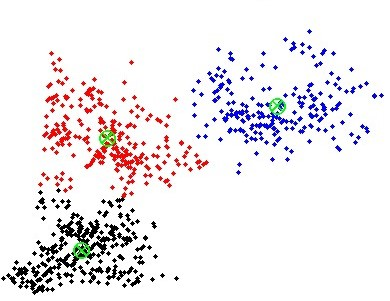

<div align="left">
<h1>
    </img>
</h1>
Welcome to A December of Algorithms (2019). After the overwhelming response from last year, we present you with a new collection of algorithms to implement this December. Each Day, Each Algorithm ;) Finish them all to get prizes and certificate :)

**Send a pull request only after completing all 31 algorithms.**

**Please submit all PRs on or before January 10th 11:59 PM IST.**

## What Do I Do?
We have a small collection of algorithms, one for every day of the month. Scroll down to take a look at them. All you need to do is fork this repository, implement all 31  algorithms and send a pull request over to us. Check out our FAQ for more information.


## Index
  - [**December 1 - Sevenish Number**](#december-1---sevenish-number)
  - [**December 2 - Is this a valid credit card number?**](#december-2---is-this-a-valid-credit-card-number)
  - [**December 3 - The Decimation**](#december-3---the-decimation)
  - [**December 4 - Dr. Bruce Banner's H-Index**](#december-4---dr-bruce-banners-h-index)
  - [**December 5 - Convert CSV data to a HTML table**](#december-5---convert-csv-data-to-a-html-table)
  - [**December 6 - Fibonacci Prime number generation**](#december-6---fibonacci-prime-number-generation)
  - [**December 7 - Queued up**](#december-7---queued-up)
  - [**December 8 - Cheating Probability**](#december-8---cheating-probability)
  - [**December 9 - One to One?**](#december-9---one-to-one)
  - [**December 10 - Count The Cookies**](#december-10---count-the-cookies)
  - [**December 11 - Is This A Valid Email Address**](#december-11---is-this-a-valid-email-address)
  - [**December 12 - Show JaSON the way**](#december-12---show-jason-the-way)
  - [**December 13 - Toggling Switches**](#december-13---toggling-switches)
  - [**December 14 - A Wordplay with Vowels and Consonants**](#december-14---a-wordplay-with-vowels-and-consonants)
  - [**December 15 - Intruder Alert**](#december-15---intruder-alert)
  - [**December 16 - Casino Royale**](#december-16---casino-royale)
  - [**December 17 - Subway Surfer**](#december-17---subway-surfer)
  - [**December 18 - Your Password is too WEAK**](#december-18---your-password-is-too-weak)
  - [**December 19 - Periphery of a lake**](#december-19---periphery-of-a-lake)
  - [**December 20 - 100 days of summer**](#december-20---100-days-of-summer)
  - [**December 21 - Marching Partners**](#december-21---marching-partners)
  - [**December 22 - Alternating Balls**](#december-22---alternating-balls)
  - [**December 23 - Finding the centroid of a polygon**](#december-23---finding-the-centroid-of-a-polygon)
  - [**December 24 - Find the list**](#december-24---find-the-list)
  - [**December 25 - Naughty Jack**](#december-25---naughty-jack-christmas_tree)
  - [**December 26 - Build The Tower**](#december-26---build-the-tower)
  - [**December 27 - Spiralling**](#december-27---spiralling)
  - [**December 28 - Toss a coin to your Witcher**](#december-28---toss-a-coin-to-your-witcher)
  - [**December 29 - Vigenere Cipher**](#december-29---vigenere-cipher)
  - [**December 30 - Minimize Pipe Cost**](#december-30---minimize-pipe-cost)
  - [**December 31 - Build a city**](#december-31---build-a-city)
  - [**FAQ**](#faq)


## Algorithms

### **December 1 - Sevenish Number**
  - **Problem**
    - Let us now define what we mean by a sevenish number.
    - A "sevenish" number is a natural number which is either a power of 7, or the sum of unique powers of 7
    - The first 5 sevenish numbers are: `1`, `7`, `8`, `49`, `50`.
    - Now, implement an algorithm to find the `n`th sevenish number.
  - **Sample Input/Output**
      ```bash
      > sevenish_number(1)
        1
      > sevenish_number(5)
        50
      > sevenish_number(10)
        350
      ```
  - **Optional Task**
    - Create a Dynamic Programming solution to reduce the time complexity of your algorithm (if you used a brute-force approach before).
  - **Resources**
    - [Brute Force](https://stackoverflow.com/questions/8103050/what-exactly-is-the-brute-force-algorithm)
    - [Dynamic Programming](https://www.codechef.com/wiki/tutorial-dynamic-programming)
    - [Recursion](https://web.mit.edu/6.005/www/fa15/classes/10-recursion/)


### **December 2 - Is this a valid credit card number?**
  - **Problem**  
     Are credit card numbers just a random combination of the digits from 0-9? **NO!**  
     Credit card numbers are a systematic combination of numbers that can satisfy a single test. This test is created so that errors can be avoided while typing in credit card numbers as well as detect counterfeit cards!  
    
    The algorithm is as follows:
    - Reverse the order of the digits in the number.
    - Take the first, third, ... and every other odd digit in the reversed digits and sum them to form the partial sum s1
    - Taking the second, fourth ... and every other even digit in the reversed digits:
        * Multiply each digit by two and sum the digits if the answer is greater than nine to form partial sums for the even digits
        * Sum the partial sums of the even digits to form s2
    - If s1 + s2 ends in zero then the original number is in the form of a valid credit card number as verified by the Luhn test.  
    </br>
 - **Sample Input/Output**
    ```
    Reverse the digits:
    61789372994
    Sum the odd digits:
      6 + 7 + 9 + 7 + 9 + 4 = 42 = s1
    The even digits:
        1,  8,  3,  2,  9
      Two times each even digit:
        2, 16,  6,  4, 18
      Sum the digits of each multiplication:
        2,  7,  6,  4,  9
      Sum the last:
        2 + 7 + 6 + 4 + 9 = 28 = s2

    s1 + s2 = 70 which ends in zero which means that 49927398716 passes the Luhn test
    ```
    Your task is to implement to check if a given credit card number is valid or not using the above algorithm.  
  - **Example**
      ```
      Input : 49927398716
      Output: 49927398716 passes the test
      ```
  - **Resources**
    - [This is cool! Tell me more](https://www.creditcards.com/credit-card-news/luhn-formula-credit-card-number-system-1273.php)


### **December 3 - The Decimation**
  - **Problem**
    - Well, this is day 3 so let's start with something easy. Perhaps an algorithm that might involve a list and the **Marvel Supervillain Thanos**!
    - While the list isn't sorted, snap half of all things (remove them from the list). Proceed until the list is sorted or only one item remains (which is sorted by default). This sorting algorithm may give varied results based on implementation.
    - The item removal (decimation) procedure is up to the implementation to decide, but the list should be half as long as before after one pass of the item removal procedure.
    - Your algorithm may commit to take away either the first half of the list, the last half of the list, all odd items, all even items, one at a time until the list is half as long, or any not specified above.
    - **Decide for yourself:** What would Thanos do if the universe carried an odd amount of living things?
 
    - The list is sorted if no elements are smaller than any previous item. Duplicates may exist in the input and may exist in the output.
  - **Sample Input/Output**
      ```c
      // A sorted list remains sorted
      [1, 2, 3, 4, 5] -> [1, 2, 3, 4, 5]
      // A list with duplicates may keep duplicates in the result
      [1, 2, 3, 4, 3] -> [1, 3, 3] // Removing every second item
      [1, 2, 3, 4, 3] -> [3, 4, 3] -> [4, 3] -> [3] // Removing the first half
      [1, 2, 3, 4, 3] -> [1, 2] // Removing the last half
      ```
  - **Resources**
    - [Arrays in C++](http://www.cplusplus.com/doc/tutorial/arrays/)
    - [Arrays in Java](https://docs.oracle.com/javase/tutorial/java/nutsandbolts/arrays.html)
    - [Arrays in Python](https://www.w3schools.com/python/python_lists.asp)


### **December 4 - Dr. Bruce Banner's H-Index**
  - **Problem**
    - Dr. Bruce Banner is a soft-spoken scientist and among Earth's most brilliant men. At this moment though, he needs your help to find his h-index.
    - In academia, the h-index is a metric used to calculate the impact of a researcher's papers. It is calculated as follows:
    - A researcher has index h if at least h of his N papers have h citations each. If there are multiple h satisfying this formula, the maximum is chosen.
    - For example, suppose `N = 5`, and the respective citations of each paper are `[4, 3, 0, 1, 5]`
    - Then the h-index would be `3`, since the researcher has 3 papers with at least 3 citations.
    - Given a list of paper citations of Dr. Bruce Banner, calculate his h-index.
  - **Sample Input/Output**
      ```bash
      > h_index(5, [4,3,0,1,5])
        3
      > h_index(6, [4,5,2,0,6,4])
        4
      ```
  - **Resources**
    - [Arrays in C++](http://www.cplusplus.com/doc/tutorial/arrays/)
    - [Arrays in Java](https://docs.oracle.com/javase/tutorial/java/nutsandbolts/arrays.html)
    - [Arrays in JavaScript](https://developer.mozilla.org/en-US/docs/Web/JavaScript/Reference/Global_Objects/Array)
    - [Lists in Python](https://www.w3schools.com/python/python_lists.asp)


### **December 5 - Convert CSV data to a HTML table**
  - **Problem**
    - A comma-separated values (CSV) file is a delimited text file that uses a comma to separate values. A CSV file stores tabular data in plain text. Each line of the file is a data record. Each record consists of one or more fields, separated by commas. 
    - Data in a CSV file is not very easy to understand. Your task is to read data from a CSV file and convert into a code for a HTML table and store it another file with a .html extension. Use the CSV file given in the resources to build your algorithm. 
  - **Sample Input/Output**
      - **CSV**
        ```csv
        column1,column2,column3
        a,123,abc123
        b,234,bcd234
        c,345,cde345
        ```
    - **HTML**
        ```html
        <html>
            <body>
                <table>
                    <tr><th>column1</th><th>column2</th><th>column3</th></tr>
                    <tr><td>a</td><td>123</td><td>abc123</td></tr>
                    <tr><td>b</td><td>234</td><td>bcd234</td></tr>
                    <tr><td>c</td><td>345</td><td>cde345</td></tr>
                </table>
            </body>
        </html>
        ```
  - **Resources**
    - [CSV Source File](/src/res/csv_to_html_res.csv)
    - [What are CSV files?](https://www.lifewire.com/csv-file-2622708)
    - [File handling in C](https://www.geeksforgeeks.org/basics-file-handling-c/)
    - [File handling in C++](https://www.geeksforgeeks.org/file-handling-c-classes/)
    - [File handling in Java](https://www.geeksforgeeks.org/file-handling-java-using-filewriter-filereader/)
    - [File handling in Python](https://www.geeksforgeeks.org/file-handling-python/)
    - [Tables in HTML](https://www.w3schools.com/html/html_tables.asp)
    
    
### **December 6 - Fibonacci Prime Number Generation**
  - **Problem**
    - Fibonacci Numbers are a series of numbers where each number is the sum of preceding 2 numbers. 
    - Henry wants to generate prime numbers present in the Fibonacci Series. He needs your help to generate them.
       - For example, suppose `N = 3`
    - Then the series will have 3 Fibonacci prime numbers : 2,3,5
    - Given the count of prime numbers needed by Henry , compute the series for him.
  - **Sample Input/Output**
      ```
        Enter the value for (n): 5
        
        Generated Fibonacci Prime Number Generation upto (5): 
        2, 3, 5, 13, 89
      ```
  - **Resources**
    - [Fibonacci Numbers](https://en.wikipedia.org/wiki/Fibonacci_number)
    - [Fibonacci Series in Python](https://www.scaler.com/topics/fibonacci-series-in-python/)
  - **Fun Facts on Fibonacci**
    - Every positive integer can be written in a unique way as the sum of one or more distinct Fibonacci numbers in such a way that the sum does not include any two consecutive Fibonacci numbers. This is Zeckendorf Theorem.
    - Any three consecutive Fibonacci numbers, taken two at a time, are relatively prime.
    - No Fibonacci number greater than 8 is one greater or one less than any prime number.
    

### **December 7 - Queued up**
- **Problem**
	- A medical clinic assigns a token number to every patient who visits. The token number starts from 1 and it is given based on the order of arrival, to the `n` patients who arrive. But, the receptionist accepts bribe and lets a person `k` in first. The task is to print the token number and the patient's name in the order in which they see the doctor.
 	- Implement the concept of Queues to solve this problem
	- 
- **Sample Input/Output**
```
	Enter N: 5
	Enter (token no, id):
	(1, a)
	(2, b)
	(3, c)
	(4, d)
	(5, e)
	Enter k: c
	The order is:
	(3, c)
	(1, a)
	(2, b)
	(4, d)
	(5, e)
```
- **Resources**
    - [Understanding queue data structure](https://www.geeksforgeeks.org/queue-data-structure/)
    - [Stacks and queues](https://www.cs.cmu.edu/~adamchik/15-121/lectures/Stacks%20and%20Queues/Stacks%20and%20Queues.html)


### **December 8 - Cheating Probability**
  - **Problem**
    - Given an RxC Matrix in which each element represents the Department of a student seated in that row and column in an examination hall, write a code to calculate the probability of each student copying if a person from the same department sits:
    	-  In front of him = 0.3
    	-  Behind him = 0.2
    	-  To his left or right = 0.2
    	-  In any of his 4 closest diagonals = 0.025
  - **Sample Input/Output**
    - **Input**
       ``` 
        CSE ECE CSE 
        ECE ECE CSE
        ```
    - **Output**
        ```
        0.0 0.225 0.2
        0.225 0.5 0.3
        ```
    - 
  - **Resources**
    - [Arrays in C++](http://www.cplusplus.com/doc/tutorial/arrays/)
    - [Arrays in Java](https://docs.oracle.com/javase/tutorial/java/nutsandbolts/arrays.html)
    - [Arrays in JavaScript](https://developer.mozilla.org/en-US/docs/Web/JavaScript/Reference/Global_Objects/Array)
    - [Lists in Python](https://www.w3schools.com/python/python_lists.asp) 


### **December 9 - One to One?**
  - **Problem**
    - In mathematics a one to one function is that which has a unique element in the range for every corresponding domain.
    - Let there be a function `f`: `X->Y` such that  if a,b belong to `X` and if `f(a)=f(b)` then `a=b`. This proves the one to one property of a function. If there exists more than one "X's" for the same "Y's" then the function is not one to one.
    - Your task is to write a program that accepts two sets of numbers and the relationship between them and evaluate if they are indeed a one-one function.
  - **Sample Input/Output**
      ```
      Set 1: {1,2,3,4}
      Set 2: {1,4,9,16}
      Function: x^2
      Result: It is one-one.
      ```
      ```
      Set 1: {1,-1,2,-2,3,-3,4,-4}
      Set 2: {1,4,9,16}
      Function: x^2
      Result: It is not one-one.
      
      ```
   - **Optional**
     - Prove that the function is onto and hence bijective.
   - **Resources**
     - [One-One functions](http://mymathangels.com/tag/one-one-onto-function/)
     - [Bijective functions](https://www.tutorialspoint.com/injective-surjective-and-bijective-functions)


### **December 10 - Count The Cookies**
  - **Problem**
    - Tipsie, a cookie store sells cookies in jars. Each jar has one cookie in them. The store gives a free cookie if the customer returns enough cookie jars.
    - For example, if a customer Alex has `n=15` to spend on jars of cookie that cost `p=3` each. He can turn in `c=2` cookie jars to receive another cookie.
    - Initially, he buys 5 cookies and has 5 jars after eating them. He turns in 4 of them, leaving him with 1, for 2 more cookies.
    - After eating those two, he has 3 cookie jars, turns in 2 leaving him with 1 cookie jar and his new cookie. 
    - Once he eats that one, he has 2 cookie jars and turns them in for another cookie. After eating that one, he only has 1 cookie, and his shopping ends. Overall, he has eaten `5+2+1+1=9` cookies.
    - The integers `n`, `p` and `c` represent money to spend, cost of a cookie, and the number of cookie jars he can turn in for a free cookie respectively.
    - Implement a function `cookieCount(n, p, c)` to count the number of cookies Alex could buy.
   
  - **Sample Input/Output**
    ```bash
    > cookieCount(10, 2, 5)
      6
    > cookieCount(12, 4, 4)
      3
    ```
  - **Resources**
    - [Div Mod in Python](https://www.geeksforgeeks.org/divmod-python-application/)
    - [Div Mod in C & C++](https://www.cprogramming.com/tutorial/modulus.html)
    - [Div Mod in Java](http://www.cs.ukzn.ac.za/~hughm/java/intro/week2/21.html)
    

### **December 11 - Is This A Valid Email Address**
  - **Problem**
    - While signing up for a website, you must have seen that when an invalid email address is entered, you get a warning. This is because the website validates the given email address according to some specification of a valid email address (check the resources section to know the format of a valid email address). 
    - Now, for today's challenge implement your own email address verification algorithm.
    - For the sake of simplicity, assume that a valid email address has the following format:
      - `local_part@domain`
      - The `local_part` should contain only alphabets, numbers and the characters: `_`, `.`, `-`.
      - The `domain` should contain only alphabets followed by `.com`
  - **Example**
      ```
      // Valid email addresses
      john-doe31@gmail.com
      jane.austen_691@dnarifle.com
      ```
  - **Optional Problem**
    - Implement an algorithm to verify an email address based on the complete syntax specification (given in the resources section).
  - **Resources**
    - [Complete Syntax Specification of Email Addresses](https://en.wikipedia.org/wiki/Email_address#Syntax)
  - <details><summary><b>Still stuck?</b></summary>
      <ul>
          <li>Use Regular Expressions to verify the format of the email.</li>
          <li><a href="http://www.cplusplus.com/reference/regex/">Regular Expressions in C++</a></li>
          <li><a href="https://www.tutorialspoint.com/python/python_reg_expressions.htm">Regular Expressions in Python</a></li>
          <li><a href="https://developer.mozilla.org/en-US/docs/Web/JavaScript/Guide/Regular_Expressions">Regular Expressions in JavaScript</a></li>
          <li><a href="https://www.javatpoint.com/java-regex">Regular Expressions in Java</a></li>
      </ul>
    </details>


### **December 12 - Show JaSON the way**
  - **Problem** 
  	- Jason is stranded in a desert.His phone's battery is going to die out and all he has left is a compass.
    - Parse the JaSON.json(in src/res) file and get the latitude and longitude values of the current and destination location.
    - Also find the distance between those two locations (refer resources for the link)
    - Return a Directions json file with your personalized message, distance and some direction.
  - **Sample Input/Output**
       - **JaSON.json(src/res):**
       ```json
       {
  		"markers": 
		[
			{
				"name": "start",
				"location": [25.1212, 55.1535],
			},
			{
				"name": "destination",
				"location": [25.2285, 55.3273]
			}
  		]
       }
       ```
       - **Sampl- Inpute Output:**
       ```json
       {
        "directions": 
		[
			  {
			    "message": "Meet at the destination point",
			    "distance": 21.17,
			    "direction": "N"
			  }
        ]
       }
       ```
  - **Resources**
    - [Java JSON parsing](https://www.mkyong.com/java/json-simple-example-read-and-write-json/)
    - [Python JSON parsing](https://docs.python.org/3/library/json.html)
    - [C++ JSON parsing](https://nlohmann.github.io/json/)
    - [Calculate distance](https://stackoverflow.com/questions/365826/calculate-distance-between-2-gps-coordinates)
  - **Note**  
    JSON format can differ and values like message and direction are totally upto you.


### **December 13 - Toggling Switches**
  - **Problem**  
    - There are `n` switches labeled from 1 to `n`,to turn on/off `n` bulbs.
    - At start all the bulbs are switched off
    - At first round, every bulb is turned `on`
    - At second round, every second switch is turned `off`
    - At third round, every third switch is toggled on/off (on->off and off->on)
    - This goes on and during nth round, every nth switch is toggled on/off.
    - The task is to write `O(n)` and constant time functions to find how many switches are in the `on` state (two separate functions).
    - [optional] Find the switch nos. that are in the 'on' state after n such iterations.

  - **Sample Input/Output**
  ```
  Enter no of switches: 5
       
  Iteration 0: 1->off  2->off  3->off  4->off  5->off
  Iteration 1: 1->on   2->on   3->on   4->on   5->on
  Iteration 2: 1->on   2->off  3->on   4->off  5->on
  Iteration 3: 1->on   2->off  3->off  4->off  5->on
  Iteration 4: 1->on   2->off  3->off  4->on   5->on
  Iteration 5: 1->on   2->off  3->off  4->on   5->off
  
  No of switches in the 'on' state at the end: 2
  ```
  - **Resources**
    - [Java math module](https://docs.oracle.com/javase/8/docs/api/java/lang/Math.html)
    - [Python math module](https://docs.python.org/3/library/math.html)
    - [C++ math module](http://www.cplusplus.com/reference/cmath/)


### **December 14 - A Wordplay with Vowels and Consonants**
  - **Problem**  
    - There are two players A and B. Initially, they are given the same string ```s```. 
    - They have to make substrings with letters in 's'.
    - A makes substrings starting with a vowel(a,e,i,o,u) and B makes substrings starting with consonants.
    - For each occurence of their substring in 's', the players get 1 point.
    - The task is to find who has the maximum score and what's the winner's score for a string 's'.
  - **Sample Input/Output**
       ```
       String: london
       A's score:7 (o,on,ond,ondo,ondon)
       B's score:14 (l,lo,lon,lond,londo,london,n,nd,ndo,ndon,d,do,don) 
       The winner is B with 14 points
       ```
   - **Format**
      ```
      Enter string: monkey
      The winner is B with 14 pts
      ```
  - **Resources**
    - [String in c++](https://www.w3schools.com/cpp/cpp_strings.asp)
    - [Strings in python](https://www.w3schools.com/python/python_strings.asp)
    - [Strings in java](https://www.javatpoint.com/java-string)


### **December 15 - Intruder Alert**
  - **Problem**  
    - Rick Sanchez just discovered that someone from another planet has been intruding into his private planet use its resources.
    - In order to lure that person in to humiliate him, Rick decides to send a dish as a gift. This dish has been cooked with a balance between its main ingredients: Animal A and Liquid B.
    - If for every 1g of A 1ml of B has to be added, write a code that uses **Backtracking** to print the number of ways the ingredients can be added when the quantity of A needed is provided.
  - **Sample Input/Output**
    ```
    Quantity of A(in grams): 2
    Combinations: [AABB, ABAB]
    Quantity of A(in grams): 3
    Combinations: [AAABBB, AABABB,AABBAB,ABAABB,ABABAB]
    ```
  - **Resources**
    - [Backtracking](https://www.javatpoint.com/backtracking-introduction)
    

### **December 16 - Casino Royale**
  - **Problem**  
    - In poker, players form sets of five playing cards, called hands, according to the rules of the game. Each hand has a rank, which is compared against the ranks of other hands of all those in the game and the highest hand wins all the money that everybody puts in.
    - A poker hand is specified as a space separated list of five playing cards:
    - Each input card has two characters indicating face and suit. For example: `2d` (two of diamonds).
    	- Faces are: `a`, `2`, `3`, `4`, `5`, `6`, `7`, `8`, `9`, `10`, `j`, `q`, `k`
		- Suits are: `h` :hearts: (hearts), `d` :diamonds: (diamonds), `c` :clubs: (clubs), and `s` :spades: (spades)
    - Create a program to parse a single five card poker hand and specify the poker hand ranking and produce one of the following outputs.
    ```
     straight-flush
	 four-of-a-kind
	 full-house
	 flush
	 straight
	 three-of-a-kind
	 two-pair
	 one-pair
	 high-card
	 invalid
    ```
  - **Sample Input/Output**
    ```
     2h  2h  2h  kc  qd:  three-of-a-kind
     2h  5h  7d  8c  9s:  high-card
     ah  2d  3c  4c  5d:  straight
     2h  3h  2d  3c  3d:  full-house
     2h  7h  2d  3c  3d:  two-pair
     2h  7h  7d  7c  7s:  four-of-a-kind 
     10h jh  qh  kh  ah:  straight-flush
     4h  4s  ks  5d  10s: one-pair
     qc  10c 7c  6c  4c:  flush
    ```
  	
  - **Resources**
    - [Poker hand ranking](https://en.wikipedia.org/wiki/List_of_poker_hands#Hand-ranking_categories)
    - [Arrays](https://makecode.microbit.org/types/array)
    - [Sorting](https://www.geeksforgeeks.org/sorting-algorithms)
    
    
### **December 17 - Subway Surfer**
  - **Problem**
    - Many metro train systems across the world have multiple lines. These lines often meet each other at few stations called interchanges. Commuters often change lines at interchanges based on their destination.   
    
    	     
    - In the above diagram we can observe that if we want to travel between Greenwich station and the Airport we have to travel for 10 stations in the red line : `GREENWICH -> SUNTECH  -> MARINA -> CENTRAL -> CITY HALL -> BAY -> MUSEUM -> RIVERFRONT -> DOWNTOWN -> AIRPORT`
    - However if the passengers switch trains to the blue line in CENTRAL station they can save time and reach their destination faster: `GREENWICH -> SUNTECH ->MARINA -> CENTRAL -> ZOO -> ESTATE ->AIRPORT`
    - Write a program that accepts two ordered arrays of railway lines and calculates the fastest route possible between two stations.
  - **Sample Input/Output**
      ```
      Enter Train Lines, Start and Endpoint:
      Line 1: Park, Central, Beach, Mylapore, Kilpauk
      Line 2: Central, T.Nagar, Washerampet, MKB Nagar.
      Start: Park
      End: T.Nagar
      ```
      ```
      Fastest Path: Park ->Central -> T.nagar
      ```
  - **Resources**
    - [Arrays in C++](http://www.cplusplus.com/doc/tutorial/arrays/)
    - [Arrays in Java](https://docs.oracle.com/javase/tutorial/java/nutsandbolts/arrays.html)
    - [Arrays in Python](https://www.w3schools.com/python/python_lists.asp)
    
    
### **December 18 - Your Password is too WEAK**
  - **Problem**
    - Brute Force Attack is the simplest password cracking method. This attack simply tries to use every possible ASCII printable characters (character code 32-126) combination as a password. Brute Forcing takes time but the chances of getting it right is certain.
    - The problem is to calculate the time taken to find the password given that you know the length of the password string using Brute Force and Multithreading. 
    **Note:** Brute Forcing doesn't work in real life.
  - **Sample Input/Output**
  ```
  Enter Password: T!Kk@
  Time Taken: 6723.45 seconds
  ```
  - **Resources**
    - [Multithreading in C++](https://www.geeksforgeeks.org/multithreading-in-cpp/)
    - [Multithreading in Java](https://www.geeksforgeeks.org/multithreading-in-java/)
    
    
### **December 19 - Periphery of a lake**
  - **Problem**
    - Reshwin wants to experience the scenic view of the kolleru lake from the periphery of the lake.
    - Given a set of random points (which also contains the points which lie in the periphery of the lake), Reshwin has to find the points which lie in the periphery of a lake to traverse the outer limits of the lake.
    	 
    - Develop an algorithm to help Reshwin
  - **Sample Input/Output**
  ```
  {{0, 3}, {2, 2}, {1, 1}, {2, 1}, {1, 2},{3, 0}, {0, 0}, {3, 3}}
  ```
  ```
  The outer limits are - {{0, 3}, {0, 0}, {3, 0}, {3, 3}}
  ```
  - **Resources**
    - [Convex Hull](https://www.geeksforgeeks.org/convex-hull-set-1-jarviss-algorithm-or-wrapping/)
    
    
### **December 20 - 100 days of summer**
  - **Problem**
    - Nitya wants to visit a number of cities in her summer vacation.
    -  Given a set of cities and distance between every pair of cities, the problem is to find the shortest possible route that visits every city exactly once and returns to the starting point.
    	 
    -  The input is in the form of a matrix where the indices represent the city number and the value in the matrix represents the distance between the two cities
    - The output is the least distance
  - **Sample Input/Output**  
 	For four cities A,B,C,D the input will be in the following format (**Note**: The matrix is symmetric since the distance from A->B is the distance from B->A)
 	- Input
 	```
		A	B	C	D
	 A	0km	40km	10km	30km			
	 B	40km	0km	20km	10km	
	 C	10km	20km	0km	50km		
	 D	30km	10km	50km	0km
  	```
  	- Output 
	```
	The shortest distance is 70km
	```
  - **Resources**
    - [Travelling Salesman Problem](https://www.tutorialspoint.com/Travelling-Salesman-Problem)
  
  
### **December 21 - Marching Partners**
  - **Problem**
    - Nikhil wants to organise a procession with his students.
    - In this procession, two students will walk side-by-side in each row.
    - Nikhil expects that the height difference of the two students who walk in each row should not exceed a certain threshold. That is, two students can be paired as long as their height difference does not exceed `d`.
    - If there are `n` students in the class in which the `i`th student is `H[i]` units tall, pair the maximum number of students corresponding to the above condition.
    - _Note_: A student cannot be part of more than one pair.
    - Implement a function `marching_partners(n, H, d)` that prints the maximum number of pairs that can be formed. 
  - **Sample Input/Output**  
 	```bash
	> marching_partners(5, [147,149,149,155,150], 2)
	  2
  	```	
  - **Explanation**
    - The 5 students have heights 147, 149, 149, 155 and 150 respectively. The maximum allowed difference in the heights of two students forming a pair is at most 2. It is clear that the 4th student (height 155) cannot be paired with any other student. The remaining 4 students can be paired as (1st and 3rd) and (2nd and 5th) to form 2 pairs.
  - **Resources**
    - [Greedy Algorithms](https://www.hackerearth.com/practice/algorithms/greedy/basics-of-greedy-algorithms/tutorial/)
    
    
### **December 22 - Alternating Balls**
  - **Problem**
    - There are `N` balls arranged in a row. They are either red or blue in colour.
    - A sub-row is said to be alternating if any two adjacent balls are of different colours. 
    - For each ball located at position `x` (from 1 to `N`), compute the length of the longest alternating sub-row that starts at `x`. 
    - Implement a function `alt_balls(N,arr)` that outputs the length of the longest alternating sub-row for each `x` from 1 to N.
  - **Sample Input/Output** 
   	```bash
	> alt_balls(4, [B,B,B,B])
	  1 1 1 1
	> alt_balls(4, [B,R,B,R])
	  4 3 2 1
	> alt_balls(6, [B,B,B,R,B,B])
	  1 1 3 2 1 1 
 	```	
  - **Explanation**
    - `Case 1`: No two balls have different colours, so any alternating sub-row may only consist of a single ball.
    - `Case 2`: Every sub-row is alternating.
    - `Case 3`: The only alternating sub-row of length 3 is from position 3 to 5.
  - **Resources**
    - [Dynamic Programming](https://www.topcoder.com/community/competitive-programming/tutorials/dynamic-programming-from-novice-to-advanced/)  	
    
    
### **December 23 - Finding the centroid of a polygon**
  - **Problem**
    - Given a set of vertices, write a function to find the centroid of a closed polygon.
    - Centroid of a polygon is its geometric centre.
    - It can be determined by referencing the Shoelace Formula.
  - **Sample Input/Output**
      ```
 	Vertices={{3,4},{5,2},{6,7}}
	Centroid={4.66,4.33}
	
	Vertices={{0,4},{0,0},{4,0},{4,4}}
	Centroid={2,2}
	
	Vertices={{0,0},{0,40},{80,40},{80,90},{0,90},{0,120},{120,120}}
	Centroid={66.9,65}
      ```
      ```
      Case 1: 
      Centroid is calculated using centroid of a triangle formula.
      
      Case 2:
      Centroid for a square is point of intersection of its diagnols.
      
      Case 3:
      Centroid is calculated for irregular polygons by calculating seperate summation of areas and 
      dividing them for x and y coordinates.
      ```
    - **Resources**
      - [Shoelace Formula](https://en.wikipedia.org/wiki/Shoelace_formula)
      - [Centroid](https://en.wikipedia.org/wiki/List_of_centroids)
    
    
### **December 24 - Find the list**
  - **Problem**
  	- Reena has an algorithm which prints the three continuous elements of a circular doubly linked list.It begins with the first element or the head of the list and runs till infinity. 
	- Say for example when the list is `89,67,33,44` the algorithm's output is `89,67,33,67,33,44,33,44,89,......`
	- Given a part of the output of the algorithm ,help Reena to find the actual number of elements in the list and print the input list with respective elements.
  - **Sample Input/Output** 
  	- Input:
		- Length of the list returned as output by the algorithm
		- Elements returned by the algorithm
		```
		12
		54 65 44 65 44 89 44 89 54 89
		```
	- Output:
		- Length of the original list
		- Elements of the original list
		```
		4
		54 65 44 89
		```
  - **Resources**
    - [Doubly linked list](https://www.geeksforgeeks.org/doubly-linked-list/)  
    - [Circular linked list](https://www.geeksforgeeks.org/circular-linked-list/)
    
    
 ### **December 25 - Naughty Jack** :christmas_tree:
  - **Problem**
  	- Ho Ho oh no! It's Christmas today but Santa and his logistics support team have encountered problems in making their deliveries. 
	- Jack, a member of Santa's notorious naughty list has decided to hack into the North Pole's servers and deleted some data to interfere with delivery operations. Luckily, the elves know their way around Server Storages.
	- Help the Elves to restore the data erased by Jack. Luckily the data has been stored in compliance with the principles of **RAID**. Create an algorithm that would restore Santa's data and resume operations at the north pole.
	- Missing bits are denoted by `*`, parity bits(even parity) are followed by a `P`
  - **Sample Input/Output** 
	-  ```
		             DISK 1 | DISK 2 | DISK 3 | DISK 4 | DISK 5
		                0        1        *        0       1P
		                1        0        0        0P      *
		                1        1        0P       *       1
		                *        1P       0        1       0
		                1P       0        0        0       *
		   
	     After data restoration: 
	     
	                 DISK 1 | DISK 2 | DISK 3 | DISK 4 | DISK 5
		                0        1        0        0       1P
		                1        0        0        0P      1
		                1        1        0P       1       1
		                0        1P       0        1       0
		                1P       0        0        0       1  
	```     
  
  
  - **Resources**
    - [Raid Storage](https://en.wikipedia.org/wiki/RAID)  
    - [Parity Bits](https://www.computerhope.com/jargon/p/paritybi.htm)
  
  
 ### **December 26 - Build The Tower** 
  - **Problem**
  	- Mento Constructions has planned to build a tower with `n` compartments, where height of i-th compartment is given by `hArr[i]`
	- The tower will be made on a consecutive section of the compartments.
	- The height starts from 1 and increase by exactly 1 each time till some height and then decrease by exactly 1 each time to height 1. Also, heights of all the compartments other than of the tower should have zero height, so that the tower is visible to people.
	- You want to construct a tower. For that, you can reduce the heights of some of the compartments. In a single operation, you can reduce the height of a compartment by 1 unit.
	- Create a function `buildTower(n,hArr)` that prints the minimum number of operations required to build a tower. Here `n` represents the number of compartments and `hArr` represents the array of heights.
  - **Sample Input/Output** 
  	```bash
	> buildTower(3,[1, 2, 1])
	  0
	> buildTower(4,[1, 1, 2, 1])
	  1
	> buildTower(5,[1, 2, 6, 2, 1])
	  3
 	```	
  - **Explanation**
    - `Case 1`: A tower is already present. So, there is no need to make any operation.
    - `Case 2`:  If you reduce the height of the first compartment to 0. You get 0 1 2 1. The blocks 1, 2, 1 form a tower. So, the answer is 1.
    - `Case 3`:  One possible tower can be 1 2 3 2 1. It requires 3 operations to build. 
  - **Resources**
    - [Binary Search](https://www.geeksforgeeks.org/binary-search/)  
     
     
### **December 27 - Spiralling**
  - **Problem**
  	- In CVV Students were made to stand in the auditorium for the morning assembly.
	- They are standing in an order such that the number of rows and columns might not be equal.
	- Towards the end, students are ordered to disperse in a spiral manner.(Clockwise)
	- Develop an algorithm to traverse the matrix of students in the spiral manner.
  - **Sample Input/Output**
  	- Input:
	  ``` 	
	   1    2   3   4
	   5    6   7   8
	   9   10  11  12
	   13  14  15  16
	  ```
	- Output:
		
		```
		1 2 3 4 8 12 16 15 14 13 9 5 6 7 11 10
		```
  - **NOTE**
  	-The Algorithm should work for any number of rows and columns.
	- Input:
	  ``` 	
	   1    2   3   4   5   6
	   7    8   9   10  11  12
	   13   14  15  16  17  18  
	  ```
	- Output:
		
		```
		1 2 3 4 5 6 12 18 17 16 15 14 13 7 8 9 10 11
		```
   - **Resources**
     - [Matrix](https://www.geeksforgeeks.org/matrix/)
     
     
### **December 28 - Toss a coin to your Witcher**
  - **Problem**
    - Geralt of Rivia had accepted a contract that involved keep watch over a Ball to prevent any assassinations from happening and even identify the **[Doppler](https://witcher.fandom.com/wiki/Doppler)** who was rumored to be present during the event to assassinate the Queen.
    - After a few hours of observing he had noticed that the aristocrats had formed groups with people they knew and these groups were of a **transitive** nature.
    - A noble i knew a noble j if G[i][j] = 1.
    - Calculate the **number of groups** that were formed in the party, if there is any group with **only one member** return True denoting that it may be an assassin.
  - **Example**
  	- Input: 
	```
	[[1,1,0,1],
	[1,1,0,0],
	[0,0,1,0],
	[1,0,0,1]]
	```
  	- Output: 
	```
	Number of groups: 2
	An Assassin is present
  	```
  **Explanation:**
   - Group 1 consists of nobles i = 1,i = 2,i = 4(1 and 2 know each other, 1 knows 4 implying 2 also knows 4 through transitive property)
   - Group 2 consists of just 1 member, i = 3. Since this group has just 1 member, it is safe to assume that the person might be an assassin.


### **December 29 - Vigenere Cipher**
  - **Problem**  
    - Vigenère cipher is a type of substitution cipher invented by the 16th-century French cryptographer Blaise de Vigenère and used for data encryption.
    - To encrypt a message using the Vigenère Cipher you first need to choose a keyword (or keyphrase). You then repeat this keyword over and over until it is the same length as the plaintext. This is called the keystream.
    - The encryption can be made easy with the help of the tableau
    - 
    - If there is an 'H' in plaintext and 'M' in the keystream, it gets encrypted as 'T'. 
    ```
	 key: RELATIONS
	 Keystream: RELAT IONSR ELATI ONSRE LATIO NSREL
	 Plaintext: TOBEO RNOTT OBETH ATIST HEQUE STION
	 Ciphertext: KSMEH ZBBLK SMEMP OGAJX SEJCS FLZSY
    ```
   - Given a ciphered text and the key, the task is to decrypt it back to the original message.

  - **Sample Input/Output**
  ```
  	Keyword: BATTISTA
  	Keystream: BATTISTABATTIS
  	CipheredText: BSBFXDXEYAFITW
  	Message: ASIMPLEEXAMPLE
  ```
  - **Resources**
    - [Vigenere Cipher](https://pages.mtu.edu/~shene/NSF-4/Tutorial/VIG/Vig-Base.html)


### **December 30 - Minimize Pipe Cost**
  - **Problem**
    - In the island of Neverland, all the houses are connected to the main water source `S` by means of a set of pipes. 
    - A house can either be directly connected to the source, or it can be indirectly connected by a pipe to a nearby house which is in turn connected to the source.
    - Each pipe has a cost associated to it. The authorities of Neverland want to minimize this cost.
    - Given an undirected graph (represented by an edge list `edgeList` described below) of pipe connections, return the lowest cost configuration of pipes such that each house has access to water.
    - To represent an edge, we have an array of two vertices that the edge connects and a third element which represents the cost of the edge.
    - For example, the edge `['S', 'A', 20]` represents an undirected edge between vertices `S` and `A` with a cost of `20`.
    - The edge list `edgeList` consists of all such edges that exists.
    - Implement a function `minimize_cost(edgeList)` that performs the above operation.
  - **Example**
    
  - **Sample Input/Output**
  ```bash
  > minimize_cost( [ ['S','A',1], ['S','B',5], ['S','C',20], ['A','C',15], ['B','C',10] ] )
    16
  ```
  - **Explanation**
    - In the above setup, we can remove all pipes except the ones from `S` to `A`, `S` to `B`, and `B` to `C` for a total (minimum) cost of `16`.
  - **Resources**
    - [Graph Algorithms](https://www.geeksforgeeks.org/graph-data-structure-and-algorithms/)
    - [Representing Graphs](https://www.khanacademy.org/computing/computer-science/algorithms/graph-representation/a/representing-graphs)

### **December 31 - Build a city**
  - **Problem**
    - There is a city with 100 houses. The co-ordinates of the houses are given in this [csv file](https://github.com/SVCE-ACM/A-December-of-Algorithms-2019/blob/master/src/res/build_city_csv.csv). The first column consists of the x co-ordinates of all the houses and the second column consists of the y co-ordinates of the houses. 
    - The mayor of the city wants to build three supermarkets and has asked you to find the best places to build them in the city. 
    - He tells you that the supermarkets must be placed in the most optimal position so that all houses can access these supermarkets in approximately the same time.  
          
    - Use [this](https://elleknowsmachines.com/k-means-clustering/) algorithm to find the best position for the supermarkets in the city. 
    - The result is the co-ordinates of the supermarkets. 

  - **Expected output:**
  	```
  	Store 1 : (-5,5)
	Store 2 : (0,0)
	Store 3 : (5,5)
  	```
  	<sub>_For the given file these are the **approximate**(accurate upto 0.1) locations of the supermarkets_</sub>
  - **For extra points:**
    - Provide a visualization of your results, including location of the supermarkets
  - **Resources:**
    - [Data visualization in Python](https://mode.com/blog/python-data-visualization-libraries)
    - [Data visualization in C++](https://github.com/lava/matplotlib-cpp)
    - [Data visualization in java](http://www.jfree.org/index.html)
    - [Data visualization in javascript](https://blog.bitsrc.io/11-javascript-charts-and-data-visualization-libraries-for-2018-f01a283a5727)

## Maintainers
- [K-Kraken](https://github.com/K-Kraken)
- [jyuvaraj03](https://github.com/jyuvaraj03)
- [mahavisvanathan](https://github.com/mahavisvanathan)
- [shrusri27](https://github.com/shrusri27)
- [SHRIRAM0509](https://github.com/SHRIRAM0509)
- [ajaykrishnan23](https://github.com/ajaykrishnan23)
- [dhirajv2000](https://github.com/dhirajv2000)
- [dhivya141](https://github.com/dhivya141)
- [Humaidabdullah](https://github.com/Humaidabdullah)
- [Vignesh040](https://github.com/Vignesh0404)


FAQ:
======
  #### Who can join the Challenge?
  Anyone who is passionate about coding and can dedicate a little time a day for the challenge for the next 31 days.

  #### When should I submit the pull request?
  You don't need to submit it everyday. Just submit it once you're done with all 31 algorithms.

  #### What if I'm not able to code every day?
  Not a problem. While coding every day is nice, we understand that other commitments might interfere with it. Plus its holiday season. So you don't have to solve one problem every day. Go at your own pace. One per day or 7 a week or even all 30 in a day.

  #### What language should I use to code?
  Anything! New to C? Best way to practice it. Wanna find out what all this hype about Python is? Use it! Any and all languages are welcomed. Maybe you could try using a different language for every problem as a mini-challenge?

  #### Fork? Pull request? What is all that? I don't know how to use GitHub!
  If you are new to Git or GitHub, check out this [small tutorial from our team](https://github.com/ASS-G/Git-Training-Kit) and [GitHub](https://guides.github.com/activities/hello-world/)

  #### Where are the rest of the problems?
  Our code ninjas are hard at work preparing the rest of the problems. Don't worry, they'll be up soon.

  #### How should I complete these programs?
  We have a folder for each day of the month. Simply complete your code and move the file into that folder. Be sure to rename your file to the following format: `language_username` or `language_username_problemname`
  Some examples:
  `python_exampleUser.py`
  `c_exampleUser.c`
  **Please do not modify any existing files in the repository.**

  #### I forked the repository but some problems were added only after that. How do I access those problems?
  Not to worry! Open your nearest terminal or command prompt and navigate over to your forked repository. Enter these commands:
  ```bash
  git remote add upstream https://github.com/SVCE-ACM/A-December-of-Algorithms-2019.git
  git fetch upstream
  git merge upstream/master
  ```
  If you're curious, the commands simply add a new remote called upstream that is linked to this repository. Then it 'fetches' or retrieves the contents of the repository and attempts to merge it with your progress.
  Note that if you've already added the upstream repository, you don't need to re-add it in the future while fetching the newer questions.

  #### I received a merge error. What do I do?
  This shouldn't happen unless you modify an existing file in the repository. There's a lot of potential troubleshooting that might be needed, but the simplest thing to do is to make a copy of your code outside the repository and then clone it once again. Now repeat the steps from the answer above. Merge it and then add your code. Now proceed as usual. :)

  #### I'm facing difficulties with/need help understanding a particular question.
  Open up an [issue](https://github.com/SVCE-ACM/A-December-of-Algorithms-2019/issues) on this repository and we'll do our best to help you out.

###### [[Back to Top]](#----)


